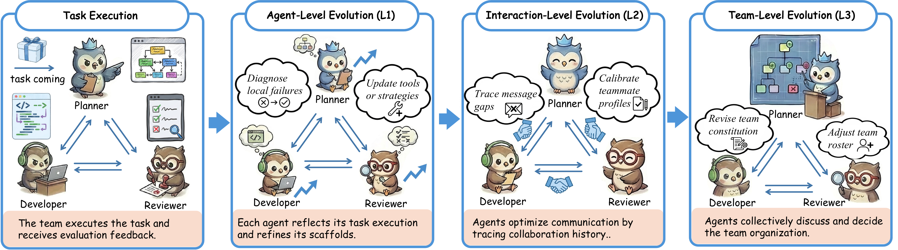

# Meta-Team

The implementations for the paper *"Evolve as a Team: Collaborative Self-Evolution for LLM-based Multi-Agent Systems"*.

> LLM-based multi-agent systems (MAS) have emerged as an effective paradigm for complex and long-horizon tasks. However, in real-world tasks, MAS often exhibit various failures during execution that are difficult to eliminate during design. To address this challenge, we propose **Meta-Team**, an experience-driven MAS evolution framework based on collaborative self-evolution. Meta-Team preserves the execution context of each agent and coordinates post-task communication, enabling agents to exchange distributed evidence for evolution. Building on this design, Meta-Team conducts multi-scale self-evolution, transforming execution experience into reusable improvements to agent behaviors, inter-agent coordination, and team-level organization.

## Overview

Meta-Team advocates a simple principle: **a MAS should not only execute as a team, but also evolve as a team**. After each task, the team reflects collaboratively at three levels:

| Level | Scope | What Evolves |
|-------|-------|-------------|
| **L1** Agent-Level | Individual agent scaffold | Prompt patches, skill additions |
| **L2** Interaction-Level | Communication patterns | Teammate profiles, collaboration notes |
| **L3** Team-Level | Shared team scaffold | Constitution, organization, coordination rules |


<p align="center">
  
</p>


## Installation

```bash
cd Meta-Team
pip install -e .
cp .env.example .env
# Edit .env with your LLM API configuration
```

**Requirements**: Python >= 3.10, Docker (for SWE-bench / BeyondSWE tasks)

## Configuration

Meta-Team uses any OpenAI-compatible LLM API. Edit `.env`:

```bash
# LLM Gateway (OpenAI-compatible)
DEV_API_BASE=https://api.anthropic.com/v1
DEV_API_KEY=sk-your-key-here
```

All experiments use **Claude Sonnet 4.6** (`temperature=0.2, max_tokens=32768`). The model name is configured in each agent pool's `config.yaml`.

## Data Preparation

Download benchmark data into the corresponding directories before running experiments:

| Benchmark | Location | Source |
|-----------|----------|--------|
| SWE-bench Pro | `benchmarks/SWE-bench-Pro/` | [ScaleAI/SWE-bench_Pro](https://huggingface.co/datasets/ScaleAI/SWE-bench_Pro) + Docker images |
| BeyondSWE | `benchmarks/BeyondSWE/data/` | [BeyondSWE](https://github.com/AweAI-Team/BeyondSWE) + Docker images |
| LOCA-Bench | `benchmarks/LOCA-bench/` | [LOCA-bench](https://github.com/hkust-nlp/LOCA-bench) |
| GAIA | `data/gaia/val_files/` | [GAIA](https://huggingface.co/datasets/gaia-benchmark/GAIA) (attachment files only; task splits are pre-included) |
| LoCoBench | `benchmarks/LoCoBench/` | [LoCoBench](https://github.com/SalesforceAIResearch/LoCoBench) |
| ResearchRubrics | `data/researchrubrics/researchrubrics.jsonl` | [ResearchRubrics](https://huggingface.co/datasets/ScaleAI/researchrubrics) |

## Evolution and test

Each benchmark follows the same pipeline: **Evolve** (around 20 cases) → **Freeze** (save evolved team) → **Test** (holdout).
All results are reported as **avg@3** (run the test 3 times independently and average).

### SWE-bench Pro

```bash
# Ansible
bash scripts/run_swebench_pro_paper_experiment.sh evolve ansible
bash scripts/run_swebench_pro_paper_experiment.sh freeze <run_id> ansible
bash scripts/run_swebench_pro_paper_experiment.sh test ansible pool_SWE_Pro_evolved_ansible --rollout 3

# Qutebrowser
bash scripts/run_swebench_pro_paper_experiment.sh evolve qutebrowser
bash scripts/run_swebench_pro_paper_experiment.sh freeze <run_id> qutebrowser
bash scripts/run_swebench_pro_paper_experiment.sh test qutebrowser pool_SWE_Pro_evolved_qutebrowser --rollout 3
```

### BeyondSWE

```bash
# CrossRepo
bash scripts/run_beyondswe_paper_experiment.sh evolve crossrepo
bash scripts/run_beyondswe_paper_experiment.sh freeze <run_id> crossrepo
bash scripts/run_beyondswe_paper_experiment.sh test crossrepo pool_BeyondSWE_evolved_crossrepo --rollout 3

# DepMigrate
bash scripts/run_beyondswe_paper_experiment.sh evolve depmigrate
bash scripts/run_beyondswe_paper_experiment.sh freeze <run_id> depmigrate
bash scripts/run_beyondswe_paper_experiment.sh test depmigrate pool_BeyondSWE_evolved_depmigrate --rollout 3
```

### LOCA-Bench

```bash
bash scripts/run_locabench_paper_experiment.sh evolve-mt
bash scripts/run_locabench_paper_experiment.sh freeze <run_id> <version>
bash scripts/run_locabench_paper_experiment.sh eval-all pool_LOCAbench_evolved
```

LOCA-Bench uses 5 seeds per task; results are averaged across all seeds.

### GAIA

```bash
bash scripts/run_gaia_evolve_and_test.sh evolve
# Promote: cp -r runs/<run_id>_evolve/team/<latest_version> agents/pool_GAIA_MT_evolved
bash scripts/run_gaia_evolve_and_test.sh test pool_GAIA_MT_evolved --rollout 3
```

### LoCoBench

```bash
# Feature Implementation
bash scripts/run_locobench_paper_experiment.sh evolve fi
bash scripts/run_locobench_paper_experiment.sh freeze <run_id> fi
bash scripts/run_locobench_paper_experiment.sh test fi pool_LoCoBench_evolved_fi --rollout 3

# Cross-file Refactoring
bash scripts/run_locobench_paper_experiment.sh evolve cr
bash scripts/run_locobench_paper_experiment.sh freeze <run_id> cr
bash scripts/run_locobench_paper_experiment.sh test cr pool_LoCoBench_evolved_cr --rollout 3
```

### ResearchRubrics

```bash
bash scripts/run_rr_paper_experiment.sh evolve
bash scripts/run_rr_paper_experiment.sh freeze <run_id>
bash scripts/run_rr_paper_experiment.sh test pool_DeepResearch_evolved --rollout 3
```

> **Note**: Each `evolve` step prints its `run_id` upon completion — use it in the subsequent `freeze` step.

### Dynamic Team Template Selection

Pools can opt into the task-family template layer with:

```yaml
settings:
  team_selection_enabled: true
```

When enabled, selection is deliberately two-stage:

1. The family selector receives only the raw task and the current `templates.json` catalog.
2. If no family matches, a separate cold-start composer receives public Agent profiles and selects a provisional roster.
3. The Chairman sees only that selected roster through Runner recruitment tools.
4. After an evolved task finishes, Team Reflection may create the cold-start family as `v1`, retain it, or refine the current template in place (`v -> v+1`).

Templates contain only a family and recruitable member roles. The Chairman is global to the pool and comes from `pool.yaml`; it is not duplicated per template. Templates must not contain DAGs, subtasks, assignments, slots, capabilities, skills, or handoff rules. Agent skills remain private files under each Agent's own `skills/` directory.

If `team_selection_enabled` is absent or false, Runner preserves its legacy unrestricted pool behavior.

## Project Structure

```
Meta-Team/
├── core/                    # Framework engine
│   ├── agent.py             # Agent loop (LLM + tools)
│   ├── runner.py            # Task execution lifecycle
│   ├── reflection_runner.py # Three-layer evolution orchestration
│   ├── llm.py              # LLM API with retry
│   └── message_store.py    # Inter-agent communication
├── tools/                   # Agent capabilities
│   ├── primitives.py       # Team primitives (recruit, send_message, terminate)
│   ├── docker_bash.py      # Sandboxed code execution
│   └── reflection.py       # Evolution tools (L1/L2/L3)
├── evaluation/              # Rubric-based evaluation (ResearchRubrics)
├── agents/                  # Team configurations (6 base pools)
├── benchmarks/              # Benchmark adapters
├── scripts/                 # Experiment pipelines
├── prompts/                 # Reflection prompt templates
├── data/                    # Data splits and placeholders
└── assets/                  # Figures
```

## Contact

For questions or discussions, feel free to contact: haozhezheng@outlook.com
